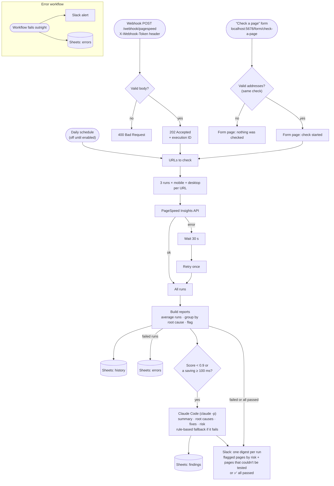

# PageSpeed Monitor

An n8n workflow that checks public web pages with Google PageSpeed Insights, uses Claude to explain what's wrong in plain English, logs everything to Google Sheets, and alerts Slack when a page needs attention.

It automates a manual process: running Lighthouse several times per page, averaging the results, grouping findings by root cause, and writing a fix plan that both developers and non-technical staff can act on. The process comes from a set of Claude Code skills I built for PageSpeed work in my current role at a SaaS company. This version uses only public websites.

> 🎥 Loom walkthrough: _link to come_

## Documentation

| Document | For | Answers |
|---|---|---|
| This README | Developers | "How does it work, and how do I set it up?" |
| [Training pack](https://github.com/dexterloor/pagespeed-monitor-training) | VAs and account staff who receive the alerts | "What does this alert mean, and what do I do about it?" |
| [Runbook](docs/runbook.md) | The operator who keeps it running | "Something's broken or odd. How do I fix it?" |
| [Incident write-ups](docs/incidents/) | Engineers | "How did a real bug get found and fixed?" |

## The problem

A single Lighthouse run is noisy, the raw report is long, and most of the people who need to act on it (account managers, virtual assistants, clients) aren't developers. Without automation, someone has to:

1. Run PageSpeed several times per page, on mobile and desktop, and average the results
2. Work out which of 30+ audits actually matter, and which ones share a cause
3. Translate that into a fix plan and a risk level
4. Remember to do it again next week, and notice regressions

## How it works



| Step | Tool | Notes |
|---|---|---|
| Trigger | n8n Schedule, Form and Webhook | See [Triggers](#triggers) below |
| Measure | PageSpeed Insights API v5 | 3 runs × 2 strategies per URL, Performance and Best Practices only. Failed requests are retried once after 30 s |
| Aggregate | `scripts/lib/psi.js` | Averages runs; keeps a finding only if it appears in most runs; groups audits into root causes |
| Flag | Thresholds in `scripts/lib/config.js` | Performance score < **0.9**, or any opportunity saving ≥ **100 ms** |
| Explain | Claude Code (`scripts/analyze.js`) | Plain-English summary, root causes, fixes, effort. The risk level comes from the rubric in code (`scripts/lib/risk.js`), so the same scores always give the same risk |
| Record | Google Sheets | `history`, `findings`, `errors` tabs ([layout](docs/sheets-setup.md)) |
| Alert | Slack incoming webhook | One digest per run: flagged pages by risk, plus pages that couldn't be tested. When every page passes, a one-line ✅ message, so a missing digest means the run didn't happen |

### Triggers

| Trigger | For | What it does | `trigger` in `history` |
|---|---|---|---|
| **Daily schedule** | Everyone, automatically | 07:00 every day over the list in *URLs to check* (from `config/urls.json`). **Currently off**; see [Run it](#4-run-it) | `schedule` |
| **"Check a page" form** | Non-technical staff | A web form at `http://localhost:5678/form/check-a-page`: paste up to 10 addresses, one per line. The confirmation page says where results appear and how long it takes; invalid input gets a plain-language reason and nothing runs | `form` |
| **Webhook** | Scripts and other tools | `POST /webhook/pagespeed` with an `X-Webhook-Token` header. Validates its body and answers **202** immediately with the execution ID (or **400**) | `webhook` |

The form and the webhook share one validation function (`scripts/lib/request.js`), so they accept and reject the same input. Invalid entries are dropped and listed; a request is refused only if no valid URL is left.

The workflow JSON in [`workflows/`](workflows/) is generated by [`scripts/build-workflows.js`](scripts/build-workflows.js). The *Build reports*, *Findings row*, *Check request* and *Check form* Code nodes contain the tested code from `scripts/lib/`, and a test checks the committed JSON matches the generator, so what runs in n8n is what the tests cover.

## The AI step

`scripts/analyze.js` sends the aggregated report (never the raw page) to Claude with the prompt in [`prompts/analyze-report.md`](prompts/analyze-report.md) and a fixed JSON schema. The output gets these checks before anything is written:

1. **Schema:** `claude -p --json-schema` constrains the shape, and `validateAnalysis()` checks it again (types, enums, lengths).
2. **Grounding:** every root cause must cite Lighthouse audit ids that exist in the report. Invented findings fail validation.
3. **Risk from code:** Claude proposes a risk level, but the workflow always uses `riskFromReport()` (the same rubric, in `scripts/lib/risk.js`). If they disagree, Claude's value is kept as `claude_risk` in the script output for debugging.
4. **Fallback:** if Claude errors, times out or fails validation twice, the script builds a deterministic analysis from the report data and marks it `analysis_source: fallback`. The workflow never stops because of the AI step.

Claude runs with no tools, from an empty temp directory, with no user settings loaded, so it can only read the report it's given.

Example output: [`samples/analysis-claude.illustrative.json`](samples/analysis-claude.illustrative.json) · fallback: [`samples/analysis-fallback.illustrative.json`](samples/analysis-fallback.illustrative.json)

> **Demo vs production.** This demo runs the AI step through the locally signed-in Claude Code CLI, so it costs nothing extra to run. In production, swap this node for the Anthropic API node with a team API key.

## Run it locally

### 1. Prerequisites

- The [Claude Code CLI](https://docs.claude.com/en/docs/claude-code), signed in
- Node 22+ for the scripts and tests. **n8n 2.x needs Node 24+**
- Google Cloud project with the PageSpeed Insights, Sheets and Drive APIs, an API key, and an OAuth client (Web app, redirect URI `http://localhost:5678/rest/oauth2-credential/callback`)
- A Slack incoming webhook, and a Google Sheet set up as in [`docs/sheets-setup.md`](docs/sheets-setup.md)

```bash
cp .env.example .env      # fill in the values; .env is gitignored
npm test                  # no network or credentials needed
```

### 2. Install n8n

The scripts expect n8n and a Node 24 runtime in `~/.local/share/n8n-runtime` (override with `N8N_RUNTIME`), so nothing global changes:

```bash
mkdir -p ~/.local/share/n8n-runtime && cd ~/.local/share/n8n-runtime
# Node 24 from nodejs.org (macOS arm64 shown; verify against SHASUMS256.txt)
curl -O https://nodejs.org/dist/v24.21.0/node-v24.21.0-darwin-arm64.tar.xz
tar -xJf node-v24.21.0-darwin-arm64.tar.xz && ln -s node-v24.21.0-darwin-arm64 node24
PATH="$PWD/node24/bin:$PATH" npm_config_python=/usr/bin/python3 npm install n8n@2.42.4
```

`npm_config_python` points the native build at macOS's Python 3.9. A Homebrew Python 3.12+ has no `distutils`, and n8n's bundled node-gyp fails without it.

### 3. Load credentials and workflows

```bash
scripts/import-credentials.sh   # PSI key, Google OAuth client, webhook token -> n8n's encrypted store
scripts/n8n.sh deploy           # build workflows/*.json, import and publish them
scripts/n8n.sh start            # http://localhost:5678
```

In the editor: create the owner account (first visit only), then open **Credentials → Google Sheets (PageSpeed Monitor) → Sign in with Google**.

Re-running `import-credentials.sh` keeps an existing Google credential, so your sign-in survives. `--reset-google` replaces it. `deploy` overwrites edits made to the workflows in the editor: change `scripts/` and redeploy instead.

`scripts/n8n.sh` starts n8n with only the environment it needs: n8n's settings, `SLACK_WEBHOOK_URL`, `GOOGLE_SHEET_ID`, the Claude CLI path, and the optional `CLAUDE_MODEL`, `CLAUDE_TIMEOUT_MS`, `ANALYZE_FORCE_FALLBACK` and `SLACK_PREFIX`. It also enables the Execute Command node, which n8n 2.x turns off by default, and keeps execution history for 7 days.

### 4. Run it

```bash
curl -X POST http://localhost:5678/webhook/pagespeed \
  -H "X-Webhook-Token: $WEBHOOK_TOKEN" -H 'Content-Type: application/json' \
  -d '{"urls": ["https://www.wikipedia.org/", "https://www.theverge.com/"]}'
# {"status":"accepted","execution_id":"12","urls":[...],"message":"Results go to Google Sheets and Slack when the run finishes."}
```

Or open **http://localhost:5678/form/check-a-page**, paste one or more addresses (one per line) and click **Check now**.

A run takes about 1.5 minutes for one URL, and longer for several.

**The daily schedule is off for now.** It's built and tested, but stays off until the demo video is recorded so the Slack channel stays clean. To run daily at 07:00, set `SCHEDULE_ENABLED: true` in `scripts/lib/config.js` and run `scripts/n8n.sh deploy`. It only runs while the machine is awake and n8n is running; each run makes 6 PageSpeed calls per URL and up to one Claude call per flagged URL, and posts one Slack digest per run.

Useful switches when starting n8n: `ANALYZE_FORCE_FALLBACK=1` skips Claude (shows the fallback path), and `SLACK_PREFIX="[TEST] "` labels Slack messages.

## Error handling

What the workflow does on its own. For what to do as the operator, see the [runbook](docs/runbook.md).

| Failure | What happens |
|---|---|
| Any failed PSI request (timeout, `429`, `5xx`, page unreachable) | Retried once after 30 s. If it still fails, it becomes an `errors` row and the report uses the other runs (status `partial`) |
| Every run for a URL fails | URL marked `failed`: `errors` rows, listed in the Slack digest, other URLs continue |
| PSI response without the fields the report needs | Rejected per run by `extractRun()` and logged like a failed run |
| Claude unavailable, slow or returns invalid JSON | One retry, then a rule-based fallback, marked `analysis_source: fallback` in Sheets and Slack |
| A Google Sheets write fails | The run continues and the Slack digest is still sent; the failure shows in the n8n execution |
| Invalid webhook body or wrong token | `400` with the reason, or `403`. Nothing runs |
| No valid address in the form | The form shows "Nothing was checked" with the reason. Nothing runs |
| Anything else that stops the workflow | The error workflow posts to Slack and writes an `errors` row |

## Data and secrets

- Only **public URLs** are tested. No logins, cookies or private pages.
- Only the aggregated report (scores, metrics, audit ids and titles) goes to the AI step. No page content or personal data.
- The PSI API key, Google OAuth client and webhook token live in **n8n's encrypted credential store**, imported from the gitignored `.env` by `scripts/import-credentials.sh`.
- The Slack webhook URL can't be an n8n credential (the URL itself is the secret), so it's an environment variable read with `$env`. `scripts/n8n.sh` passes n8n an allowlisted environment, so the other secrets are never in n8n's environment.
- `workflows/*.json` contains no secrets or machine-specific paths. A test checks this.
- n8n listens on `127.0.0.1` only, so the "Check a page" form has no login: only someone on this machine can reach it. A hosted version would need the Form Trigger's basic auth, or n8n's own user login, in front of it.

## Tests

`npm test` runs 55 tests with Node's built-in test runner, with no dependencies to install. They cover:
- averaging, noise filtering, diagnostics, root-cause grouping and flag thresholds
- output validation (including invented audit ids), and the retry and fallback paths
- the CLI, the Sheets row mapping, and request validation shared by the form and the webhook
- regression tests on real Lighthouse 13.5 responses
- the generated n8n Code nodes, run in a sandbox against the same fixtures

## How this would scale

- **More URLs:** PSI allows about 400 requests per 100 seconds per project. The PSI node already batches (3 requests every 2 s). Past a few dozen URLs, split the list across scheduled runs or a sub-workflow per batch.
- **Hosting:** move n8n from a laptop to a small VM or n8n Cloud, with queue mode and workers for concurrency, and replace the CLI step with the Anthropic API node.
- **Storage:** Sheets is fine for hundreds of rows a day. Beyond that, write history to Postgres or BigQuery and keep Sheets as a summary view.
- **Alert fatigue:** mark each page in the digest as new, worse or ongoing by comparing against its last `history` rows, and alert only on new or worse.
- **Multi-client:** add a `client` column and route Slack alerts per client channel.

## Repo layout

```
config/urls.json            Default URL list for the daily run
prompts/                    Claude prompt (fixed JSON contract)
scripts/lib/psi.js          Extract, average, group, flag
scripts/lib/analysis.js     Output schema, validation, fallback
scripts/lib/sheets.js       Row mapping for the three tabs
scripts/lib/request.js      URL validation for the form and the webhook
scripts/lib/risk.js         Risk rubric (low/medium/high)
scripts/analyze.js          AI step CLI (run by the Execute Command node)
scripts/aggregate.js        Build a report from saved PSI responses
scripts/build-workflows.js  Generates workflows/*.json
scripts/n8n.sh              Start/stop/deploy the local n8n with the right settings
scripts/import-credentials.sh  .env -> n8n credentials
tests/                      node:test tests and real PSI fixtures
samples/                    Example reports and analyses
workflows/                  n8n workflows (main + error), generated
docs/                       Sheets setup, runbook, incident write-ups, demo script
```
